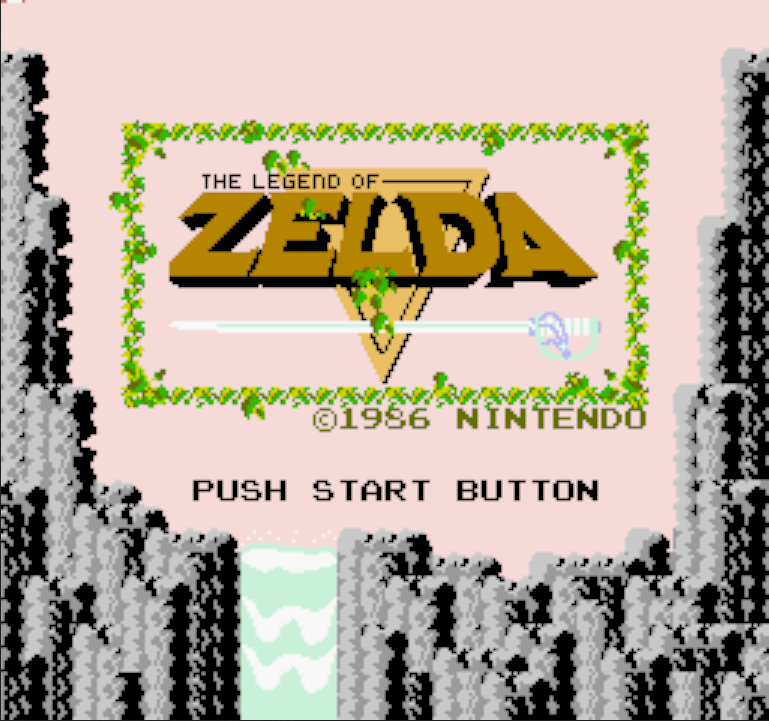

# NES-emulator

Learning project to build Nintendo Entertainment System emulator.

## Controls

`Arrow keys` - D-pad 
`S` - Start 
`A` - Select 
`Z` - Button B 
`X` - Button A 
`R` - Reset 
`Esc` - Quit  

## TODO

- [x] CPU
- [x] Display RAM & CPU status in terminal for debugging
- [x] ROM reader & mapper
- [x] Graphics window
- [x] Controls 
- [x] PPU (Pixel Processing Unit) 
  - [x] PPU background rendering
  - [x] PPU sprites
- [x] More ROM mappers
- [ ] APU (Audio Processing Unit)
- [ ] Cross-platform (Mac OS, Linux, Windows)

## References

- [Nesdev Wiki](http://wiki.nesdev.com/w/index.php/Nesdev_Wiki) 
- [javidx9 NES-tutorial](https://www.youtube.com/watch?v=nViZg02IMQo&list=PLrOv9FMX8xJHqMvSGB_9G9nZZ_4IgteYf) 
- [6502 Assembler](https://www.masswerk.at/6502/assembler.html)
- Lot's of other emulators
